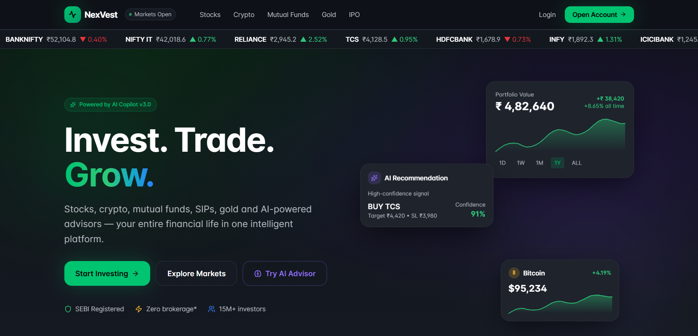
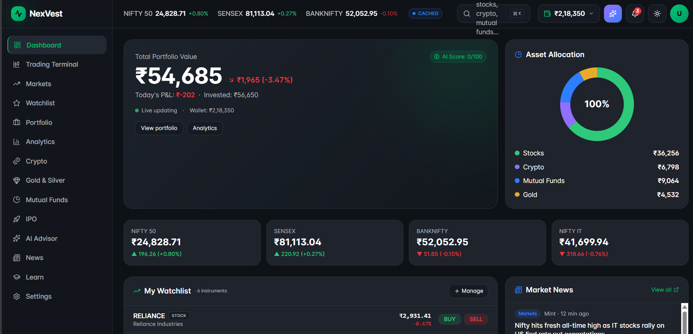
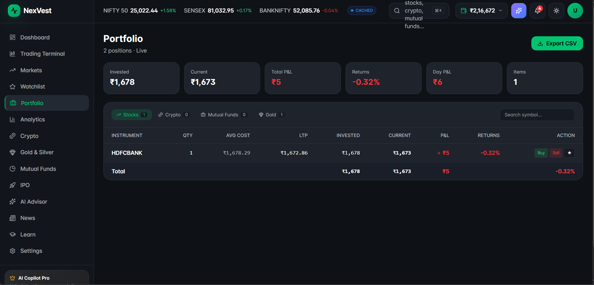
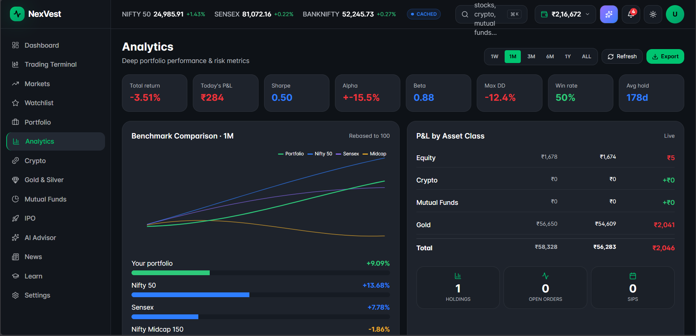
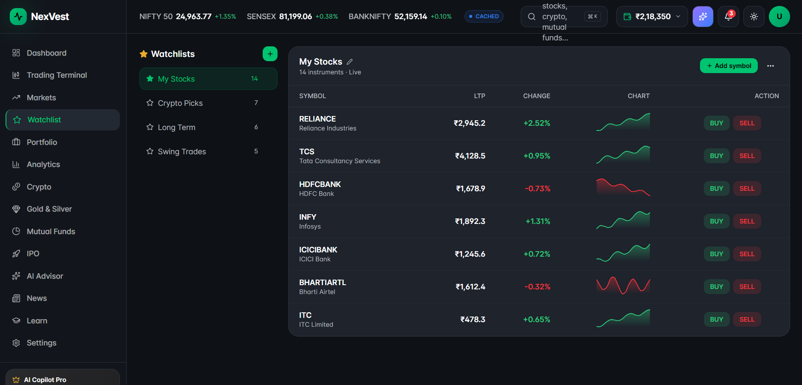
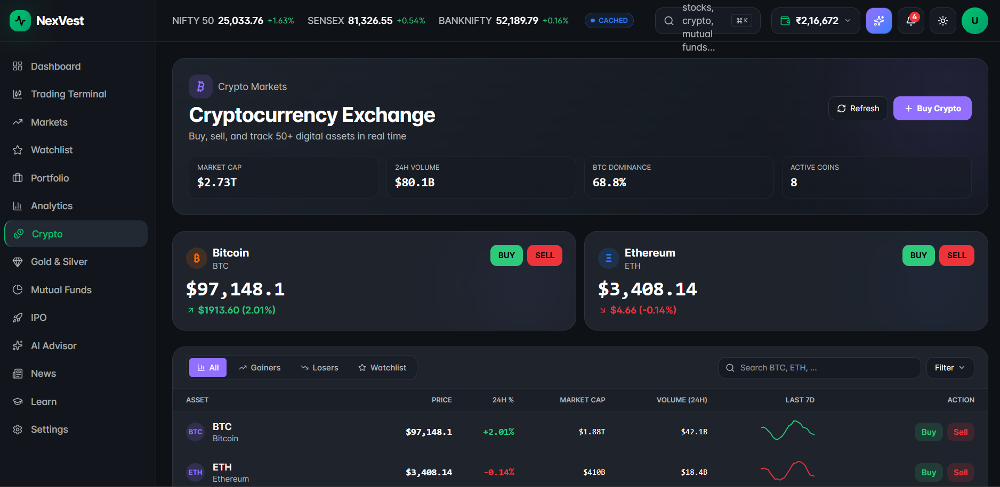
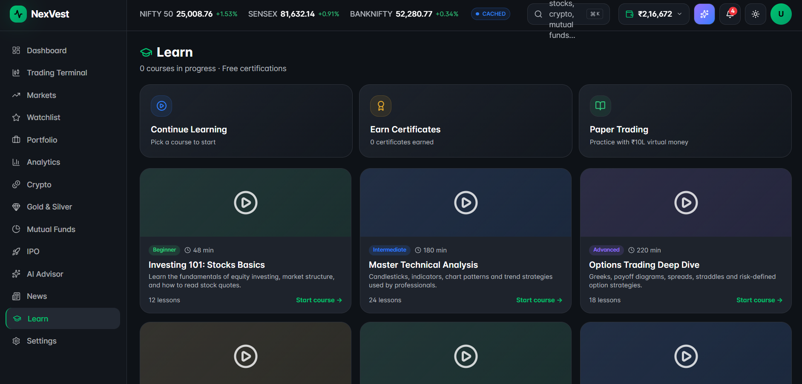
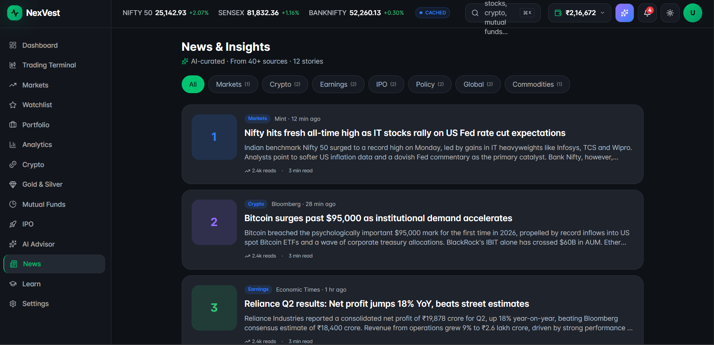
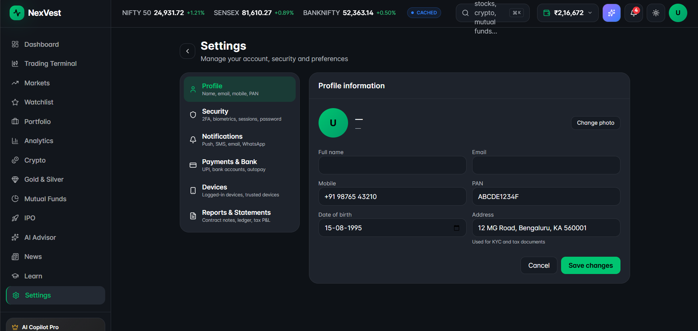

# 💹 NexVest

> AI-Powered Investment & Wealth Management Platform


---

## 🚀 Overview

NexVest is a modern AI-powered investment platform designed to provide users with an intuitive and intelligent wealth management experience.

The platform combines real-time market insights, AI-assisted portfolio analysis, investment tracking, financial education, and interactive dashboards into a unified application. Built with a scalable architecture and modern web technologies, NexVest delivers a responsive and seamless experience across devices.

---

## ✨ Features

### 📈 Market Dashboard

* Live market overview
* Trending stocks
* Global indices
* Market movers
* Interactive charts

### 💼 Portfolio Management

* Portfolio tracking
* Asset allocation
* Performance analytics
* Profit & Loss visualization
* Investment insights

### 📊 Investment Modules

* Stocks
* Mutual Funds
* Cryptocurrency
* Gold
* IPO Listings
* Watchlist

### 🤖 AI Features

* AI Investment Assistant
* Smart Financial Insights
* Personalized Recommendations
* Portfolio Analysis
* Market Intelligence

### 📰 Financial News

* Latest Market News
* Economic Updates
* Company News
* Investment Articles

### 🎓 Learn

* Investment Basics
* Financial Literacy
* Market Concepts
* Educational Resources

### ⚙️ User Features

* Secure Authentication
* Login & Signup
* Profile Management
* Settings
* Responsive Dashboard

---

# 🛠 Tech Stack

### Frontend

* React 19
* TypeScript
* Vite
* Tailwind CSS
* TanStack Router
* ShadCN UI

### UI Components

* Radix UI
* Lucide Icons
* Responsive Layout
* Interactive Charts

### Development Tools

* Bun
* npm
* ESLint
* Prettier
* Git
* GitHub

---

# 📂 Project Structure

```
NexVest
│
├── src
│   ├── components
│   ├── hooks
│   ├── lib
│   ├── routes
│   ├── styles
│   └── server
│
├── public
├── package.json
├── vite.config.ts
├── tsconfig.json
└── README.md
```

---

# ⚡ Installation

Clone the repository

```bash
git clone https://github.com/saisharatkaruturi/NexVest.git
```

Navigate into the project

```bash
cd NexVest
```

Install dependencies

```bash
npm install
```

Run the development server

```bash
npm run dev
```

The application will be available at

```
http://localhost:5173
```

---

## 📸 Screenshots

### Home Page



### Dashboard



### Portfolio



### Analytics



### AI Advisor


### Trading Terminal


### Watchlist



### Crypto



### Gold & Silver


### IPO


### Learn



### News



### Settings


---

# 🎥 Demo

A complete walkthrough of NexVest showcasing its features and user experience will be added soon.

---

# 🎯 Key Highlights

* AI-assisted investment platform
* Modern fintech dashboard
* Responsive design
* Component-based architecture
* Portfolio management
* Financial analytics
* Authentication system
* Interactive UI
* Scalable project structure

---

# 🔮 Future Enhancements

* Live Stock APIs
* Real-time Trading
* AI Portfolio Advisor
* Risk Assessment Engine
* Voice Investment Assistant
* Stock Prediction Models
* Mutual Fund Comparison
* Financial Goal Planner
* SIP Calculator
* Multi-language Support
* Dark / Light Theme
* Mobile Application

---

# 📚 Learning Outcomes

This project strengthened my understanding of:

* Advanced React Development
* TypeScript
* Frontend Architecture
* Component Reusability
* State Management
* Responsive UI Design
* Financial Dashboard Design
* API Integration
* Modern Web Development

---

# 🤝 Contributing

Contributions are welcome.

1. Fork the repository
2. Create a feature branch
3. Commit your changes
4. Push to your branch
5. Open a Pull Request

---

# 👨‍💻 Author

Sai Sharat Karuturi

Software Engineer • AI Engineer • Full Stack Developer

GitHub:
https://github.com/saisharatkaruturi

LinkedIn:
https://www.linkedin.com/in/saisharatkaruturi/

---

# ⭐ Support

If you found this project useful, please consider giving it a ⭐ on GitHub.

It motivates future development and helps others discover the project.
